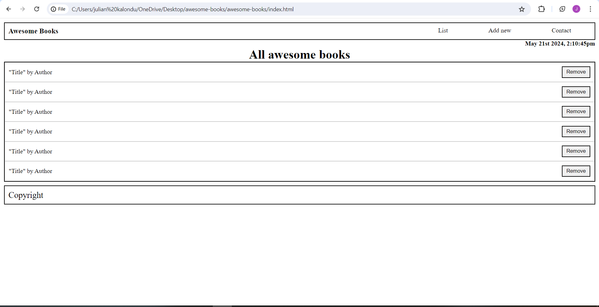
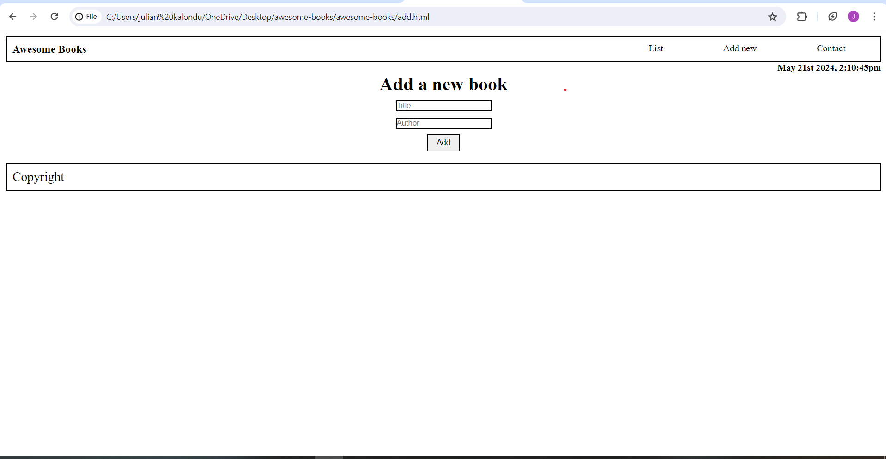
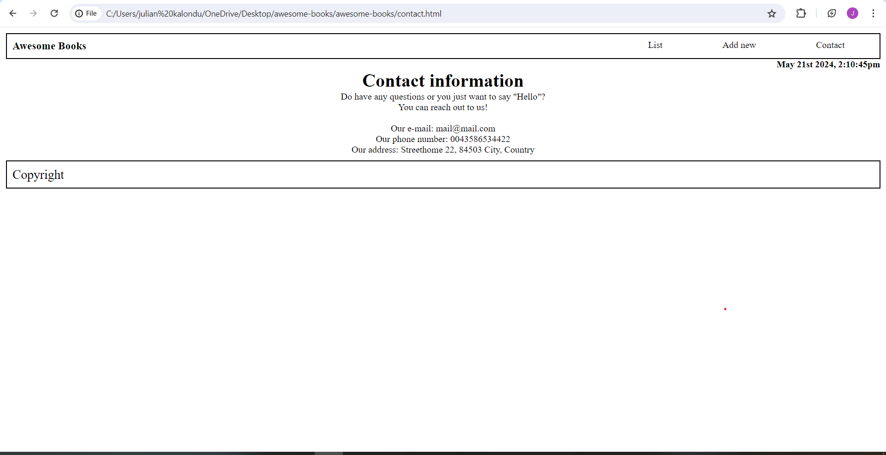

# awesome-books

## Built With

- HTML/CSS/JS 
- NodeJS 
- Linters 

## Project Presentation (LOOM)
Awesome-books - Watch Video

https://www.loom.com/share/c53f044360584fc49d64b915697ba20b?sid=b8a98d00-9ccf-4a2b-a31a-b9517d71590c

## Screnshots

To get a local copy, run the fllowing command.

- `git clone https://github.com/mbatha-17/awesome-books.git

### Prerequisites

- node.js
- git

### Usage

Run live server

## Authors

👤 **Author**

- GitHub: [@github](https://github.com/mbatha-17)

## 🤝 Contributing

Contributions, issues, and feature requests are welcome!

Feel free to check the [issues page](../../issues/).

## Show your support

Give a ⭐️ if you like this project!

## 📝 License

This project is [MIT](./LICENSE) licensed.
